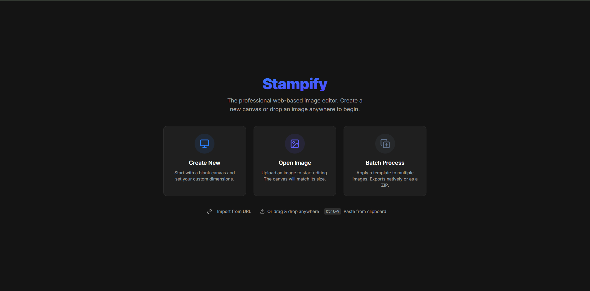
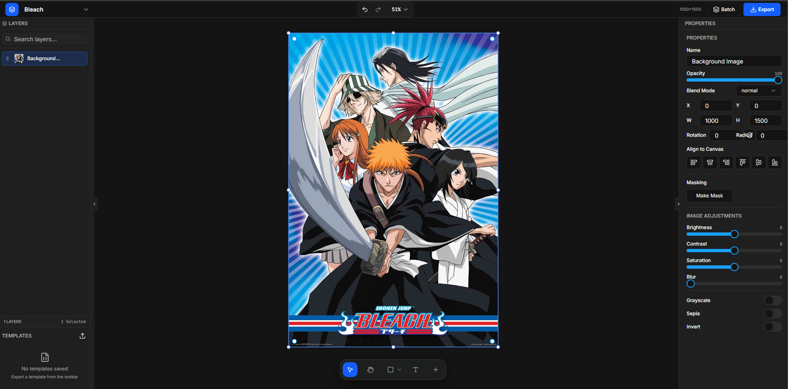

<div align="center">
  
  <h1 align="center">Stampify</h1>
  <p align="center">
    <strong>A professional, web-based Image Editor and Batch Processor.</strong>
  </p>
  <p align="center">
    
    
    
    
    
  </p>
</div>

---

## 📸 Overview

Stampify is a powerful, client-side web application designed for high-performance image manipulation, layer-based compositing, and automated batch processing. Perfect for creating social media assets, watermarking bulk photos, or designing complex layouts seamlessly in your browser.


*Launch into single-image editing or deploy a 1-click batch processing job.*


*A sleek, professional dark mode UI with comprehensive layer controls and adjustment properties.*

---

## ✨ Key Features

- **Advanced Rendering Engine**: Powered by Konva.js, rendering a robust HTML5 Canvas layered architecture.
- **Dynamic Layer Management**: Full support for Images, Text overlays, interactive Vector Shapes, Emojis, and auto-tiling Watermarks. 
- **Professional Mechanics**: Includes Figma-style corner rotation, automatic AABB marquee box selection, snap-to-grid alignment, and dragging guides. 
- **Native Blend Modes**: Utilize all standard compositing modes (`multiply`, `screen`, `overlay`, `color-burn`, etc.) instantly mapped to your canvas.
- **Smart Image Filtering**: Apply native non-destructive adjustments (Brightness, Contrast, Saturation, Blur, Sepia, Invert, Hue) completely live.
- **1-Click Batch Processing**: 
  - Save your active workspace as a **`.json` Template** layout.
  - Upload your template alongside a folder of new images to instantly pipe out individually composited ZIP files. 
  - Features smart geometry tracking (`fill` vs `fit` aspect ratio handling) for unmatched automation.
- **Premium UI**: Designed with an ultra-responsive, professional Slate & Blue theme utilizing `shadcn/ui` components and Tailwind CSS.
- **Local Persistence**: Zero-database architecture. Workspace layouts, histories, and settings sync securely to local device storage.

---

## 🚀 Quick Start

Ensure you have [Node.js](https://nodejs.org/) installed, then follow these steps:

1. **Clone the repository:**
   ```bash
   git clone https://github.com/Zan-getsu/stampify.git
   cd stampify
   ```

2. **Install dependencies:**
   ```bash
   bun install
   ```

3. **Start the development server:**
   ```bash
   bun run dev
   ```
   The application will boot up at `http://localhost:5173`.

---

## 🛠 Architecture & Tech Stack

Stampify enforces a strict, decoupled component foundation. 

| Layer              | Technology Used                                                                 |
| ------------------ | ------------------------------------------------------------------------------- |
| **Framework**      | React 18, Vite (Fast HMR)                                                       |
| **Global State**   | Zustand (`canvasStore.ts`), strictly typed payload models                      |
| **Canvas Engine**  | Konva.js / `react-konva` (Stage, Layers, Groups, Fast Native Rendering)         |
| **Styling & UI**   | Tailwind CSS (v4 inline), Radix Primitives, Custom `shadcn/ui` port             |
| **Export/Zipping** | File-Saver, JSZip, and `Konva.Stage.toDataURL()` off-screen rendering pipelines |

### Pipeline Highlights
- **Invisible Bounding Groups:** Complex SVG elements (like ellipses) are wrapped in invisible top-left coordinate groups bridging Konva's geometric origins with user-friendly GUI anchors.
- **Off-screen Generators:** The Batch processing workflow spawns a "Ghost Canvas" allowing the engine to calculate and export 100+ templated renders per minute without locking the active viewing window.
- **Autofitting Resize-Observer:** Hooks directly to DOM mutations natively shifting the active zoom matrix ensuring your workspace constantly reflects pixel-perfect editing.

---

## 🤝 Contribution

Contributions are more than welcome! 

1. Fork the Project
2. Create your Feature Branch (`git checkout -b feature/AmazingFeature`)
3. Commit your Changes (`git commit -m 'Add some AmazingFeature'`)
4. Push to the Branch (`git push origin feature/AmazingFeature`)
5. Open a Pull Request

---

## 📄 License

This project is licensed under the GNU General Public License v3.0 (GPL-3.0) - see the [LICENSE](LICENSE) file for details.
